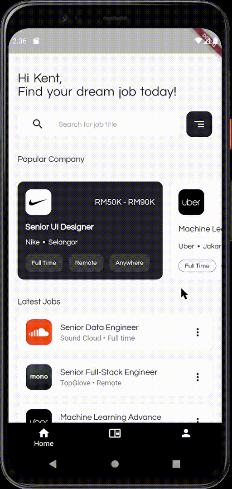
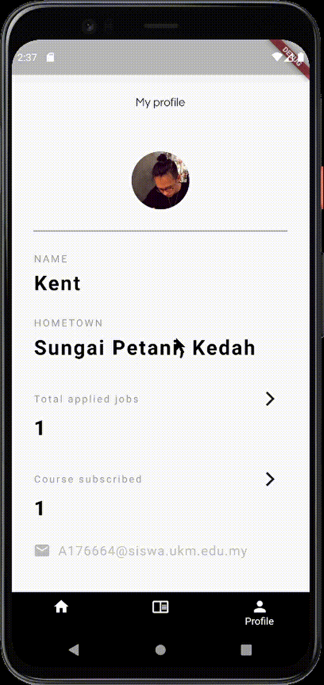

# MyJobPro+

A job finder and upskill prototype that made by using flutter.

## Getting Started

<h3>Application walkthrough<h3>

<h3>Things to take notes</h3>
<li>
This project is a prototype that is used for the course LMCR3933. 
</li>
<li>Most of the UI design is obtained from internet.</li>
<li>Functionality like search, filter is not implemented.
